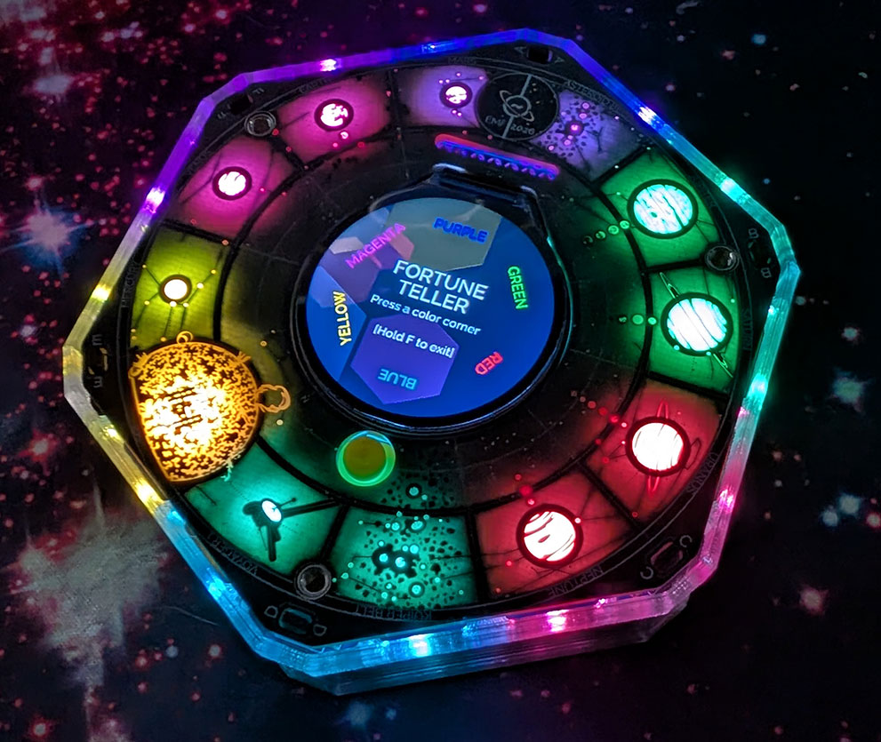
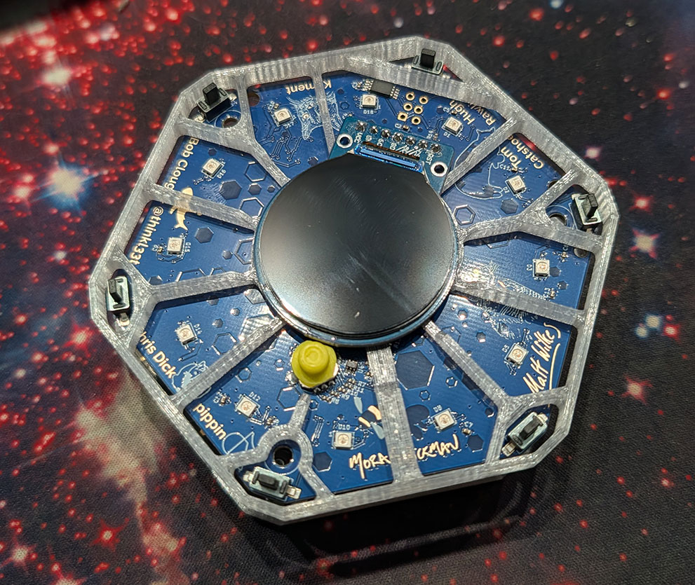
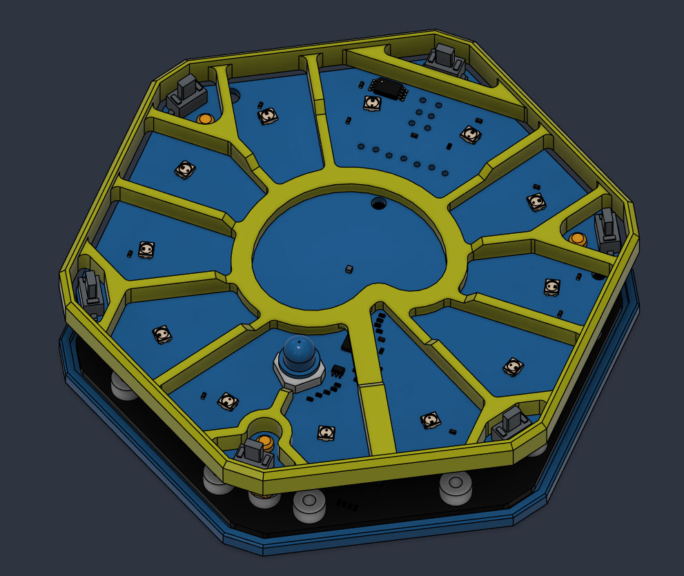
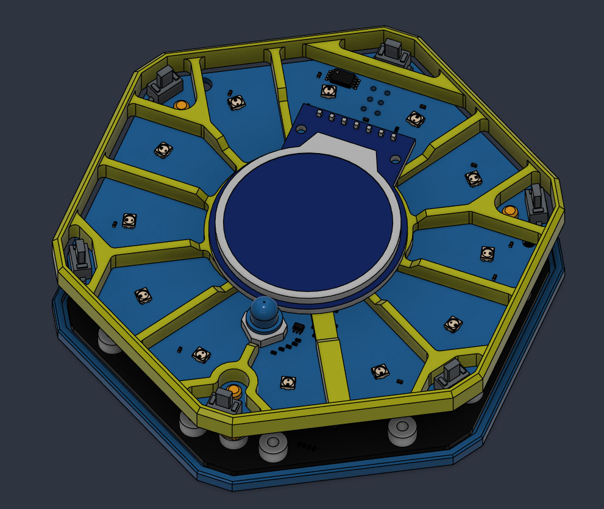
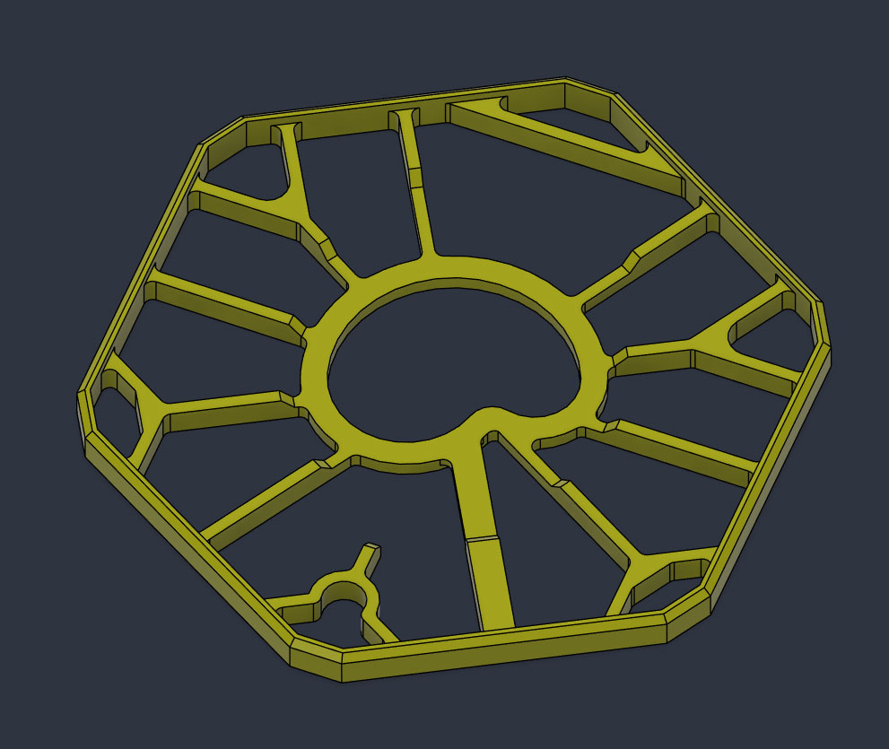
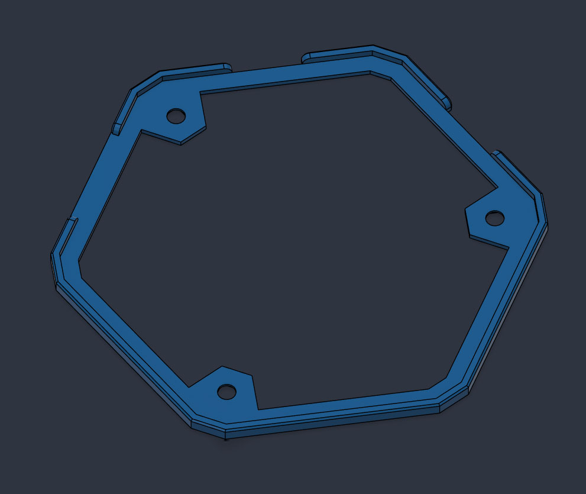

# Spaceagon Case

This repository contains the 3D model files and reference images for the Spaceagon Case, a custom bumper/diffuser for the Tildagon badge 2026 (Spaceagon).

The Spaceagon is a thing of beauty, and certainly doesn't need a case to keep the precious buttons and LED's safe. 

However if you want to make it look even more awsome and to get the most out of your LED's, then this case is for you, especially when printed in a translucent filament.

Added scratch protection and bumper protection is also provided for those who like to wear their badge, and if you're like me and don't like the feel of bare PCB edges then that's also solved by this case.

I was amazed that my prototypes actually worked when I finally got my hands on a badge in field, and then even more amazed to see people had printed their own!

## Files

- [frame-case-v14.step](frame-case-v14.step): The CAD design file in STEP format.
- [case-bottom-v14.step](case-bottom-v14.step): The bottom case.
** No baffles version has been removed.

### Physical Reference Photos
Printed in translucent PETG.    

### Assembly

### Case

### Base

A 3D printable front panel facsimile is available here - [front-panel-facsimile.stl](front-panel-facsimile.stl)

## Changelog

### Changelog since EMF 2026 (v14)
- **Base counterbore adjustment**: Increased counterbore radius to fit the washer head screws supplied with devices. Earlier versions had just enough threads to engage, but the screws were more proud. This recesses the screws further with correctly sized counterbores.
- **Top case rib & clearance**: Increased rib thickness by 0.2mm near the `A` button to prevent front-to-back flexing caused by a wider gap around the SAO connector and offset pins. Added additional clearance around the `A` button for extra safety.
- Updated 3D STEP models to v14 (`frame-case-v14.step` and `case-bottom-v14.step`).
- Removed outdated "no baffles" model variant.
- Updated physical reference photos and assembly diagrams with v14 imagery.

