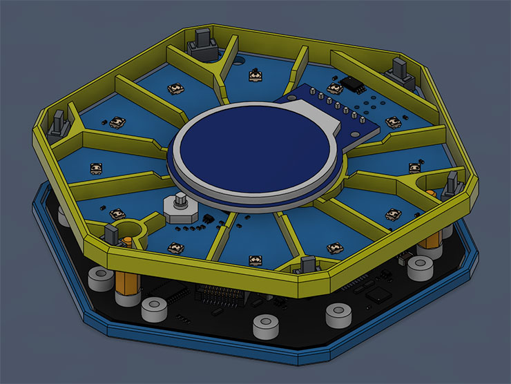
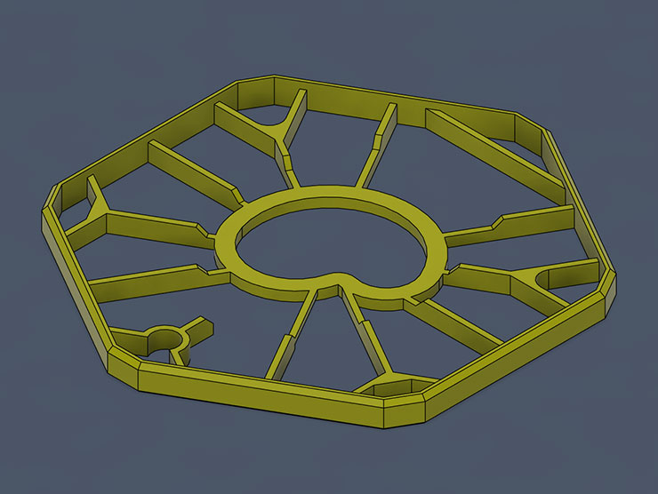
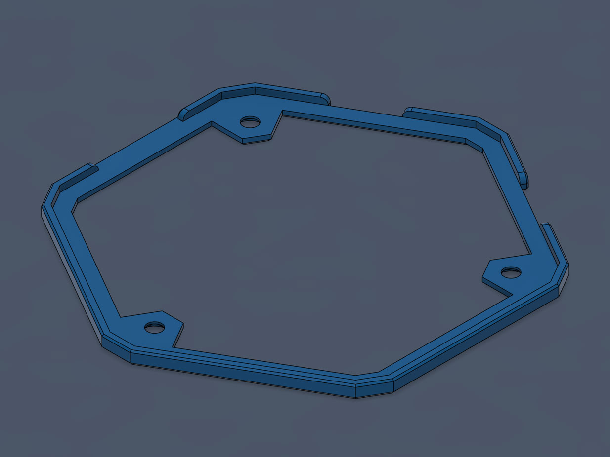
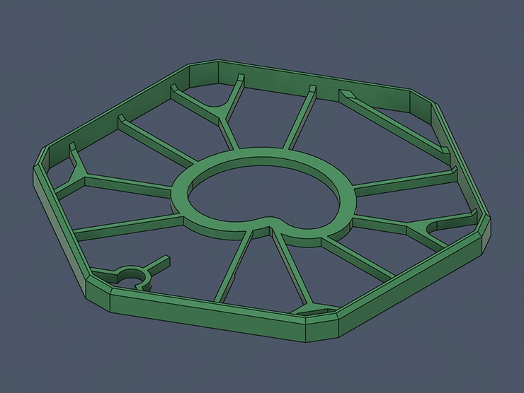
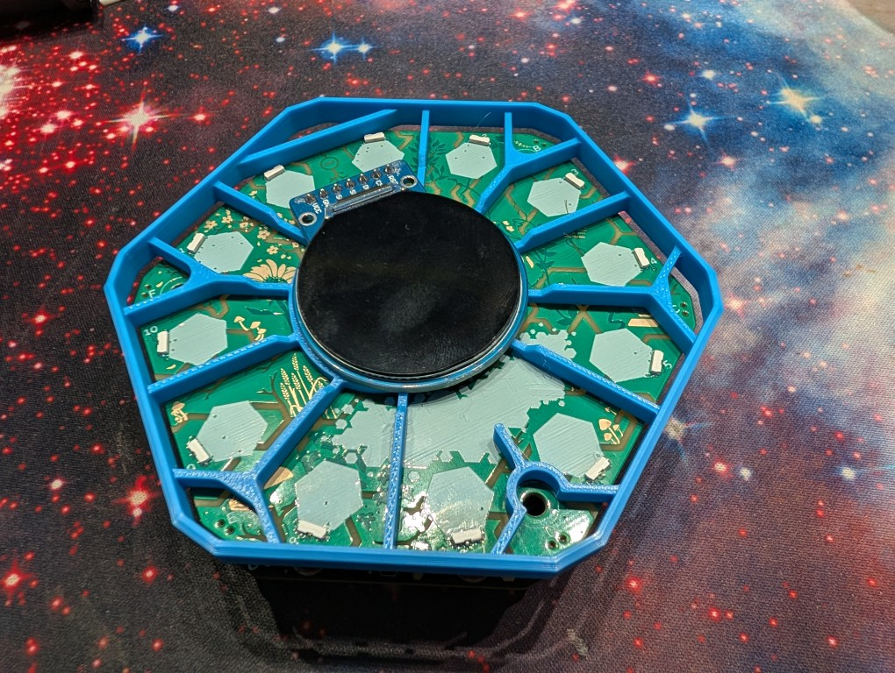

# Spaceagon Case

This repository contains the 3D model files and reference images for the Spaceagon Case (v7), a custom enclosure design for the Tildagon badge 2026.

## Files

- [frame-case-v9.step](frame-case-v9.step): The CAD design file in STEP format.
- [frame-case-v9-no-baffles.step](frame-case-v9-no-baffles.step): A variant of the case with reduced light baffles between spokes.
- [case-bottom-v9.step](case-bottom-v9.step): The bottom case.

## Preview

### Assembly

### Case

### Base

### Case (No Baffles)

This version of the case does not have as tall internal ribs to act as light baffles between the leds.
If the artwork does not mix well with the baffles, then this version may be preferable.

### Physical Reference Photo

Please note that the case is shown on the 2024 Tildagon front panel. It is technically compatible with this panel but it is not designed to accept screws from the front. A 3D printable front panel facsimile is available here - [front-panel-facsimile.stl](front-panel-facsimile.stl)
